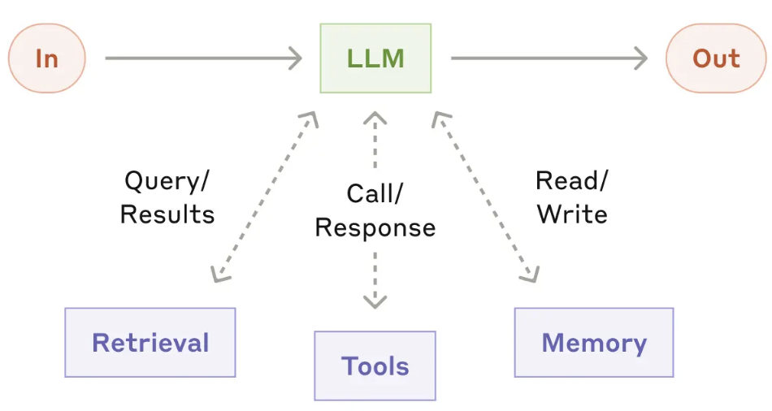
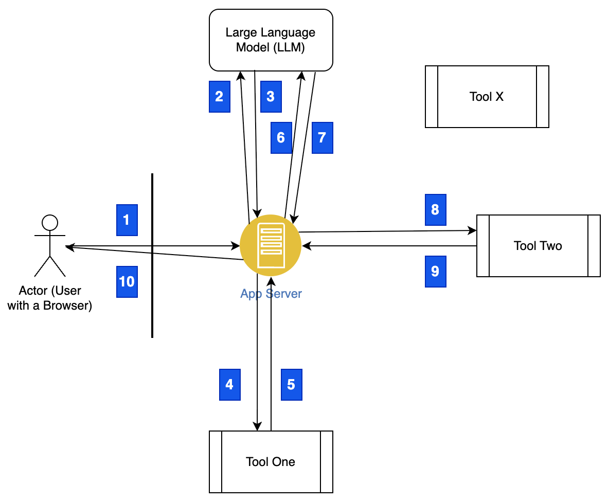
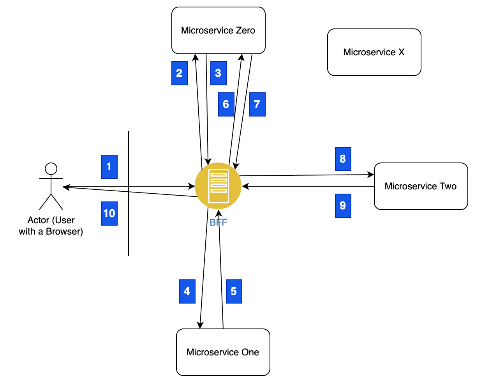
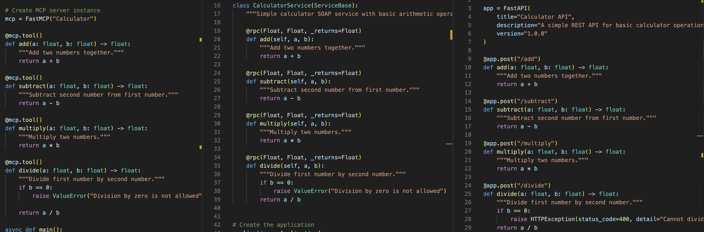

# I Wrote My First MCP Server. In 2003.

## Something New is Afoot...
When I first heard about the MCP Protocol (https://github.com/modelcontextprotocol), I got really
excited. This mysterious new protocol seemed to chain a number of AI/ML "things" together and do
really interesting stuff. All you needed to do was understand the protocol. Finally, something in the AI/ML world that's tangible -
I like it!

Of course, I got carried away. I thought there must be something "magical" within the protocol - something
I'd never seen before, that would unleash another wave of innovation. However, after reading the spec, and using it a bit, I ended up somewhat let down.

Don't get me wrong, it's not like being let down by your favorite sports team... or even someone you've built a relationship with. Nothing like that at all. Instead... it's just that it seems... so... familiar.

I started getting the feeling I'd been down this road before.

## The Diagram is Misleading

The more I thought about it, the more I was surprised at how wrong I got things. I thought that the LLM would be orchestrating a number of isolated calls - independent of any higher level of control. And once it was done, a brilliant answer would be returned.

How did I get it so wrong? I think I read more into a diagram than I should have. Here's one of the original
diagrams that was shared with the community. (You can see the image and read the article here: https://www.anthropic.com/engineering/building-effective-agents)



To the untrained eye, it appears as if you can simply make a single call to the LLM, and it will perform all kinds of wonderful actions - with no human involvement. It makes the overall flow seem architecturally unique.

Unfortunately, not all that looks new is actually new. I personally consider the following to be a far more accurate depiction of what's happening under the covers:



Here's a more detailed description of what's going on in that diagram:
1. An end user makes a traditional request to a traditional web-based app server. (This could really be anything, but without loss of generality, we're keeping things simple.)
2. The app server determines that the LLM should be called with a particular prompt and supporting materials - 
   including prompt details, context, and other things. It makes a **stateless**, **non-deterministic** call to
   the LLM.
3. The LLM does its thing. But instead of returning a traditional string of text, it returns a suggested call to a tool.
4. The app server receives the response. The MCP library can be configured to automatically invoke a tool, but that's just
   one option. Alternatively, the traditional app server can override the response, and do some other action. In this case,
   however, it accepts the LLM's suggestion, and invokes the tool with the LLM-provided parameters.
5. Much like a traditional microservice, the tool performs a traditional computation on the input, and returns
   an appropriate response, albiet dressed up in the MCP protocol.
6. The application receives the response, and decides what to do next. Again, as with step 4 above, the library can default to
   re-invoking the LLM with the data. However, that's not mandatory - the app server can do whatever it wants to do with the response.
   However, in this case, the LLM is re-invoked. (And to be clear, it makes another **stateless**, **non-deterministic** call
   to the LLM.)
7. The LLM responds with a suggestion to call another tool.
8. The app server (via the MCP library) performs a call to tool 2.
9. Tool 2 responds in a manner similar to a traditional microservice. (Again, in MCP format.)
10. The app server asserts that it has the appropriate details, and DOES NOT, re-invoke the LLM. Instead, it does traditional
    processing, formats a template, and returns it to the end user for display and additional actions.

(See Appendix A for a more through walkthrough of this flow.)

Notice anything missing? I do. There's no magic at all - at least not other than the usual LLM magic. (That LLM magic is still
pretty darn great, I'm not trying to minimize it. It's just that MCP doesn't achieve that same level of magic.)

If you think about it, we've seen this sort of diagram before. 

## Microservices and the BFF

Roughly speaking, the 2010s saw the emergence of a new architectural pattern for web-based applications: microservices.
Microservices are an architectural style where a software system is built as a collection of small, independent services that each focus on a specific business capability. Unlike monolithic applications, where functionality is bundled into a single codebase and deployment unit, microservices are loosely coupled, communicate over lightweight protocols (commonly HTTP/REST or messaging), and can be developed, deployed, and scaled independently. This approach improves agility, fault isolation, and scalability, but also introduces challenges in areas such as service coordination, data consistency, and operational complexity.

Microservices were fantastic, because they allowed independent teams to work, well... independently. However, among the new problems
that emerged were questions about how to orchestrate the interactions between the microservices. Enter the Backend For Frontend (BFF) pattern.

Backend for Frontend (BFF) is an architectural pattern where each type of client application (such as web, mobile, or IoT) has its own dedicated backend service that tailors APIs to its specific needs. Instead of forcing all clients to consume a generic, one-size-fits-all API, a BFF aggregates and reshapes data from underlying services into optimized responses for its frontend. This improves performance, simplifies client logic, and allows frontend teams to evolve independently, though it can also introduce duplication and additional operational overhead if not carefully managed.

Although originally developed to handle different types of clients (i.e. web, mobile), the BFF emerged as an orchestrator which
could manage the interactions between multiple microservices. In practice, it played a powerful role in managing the back and forth between complex, independent components.

By the late 2010s, the following pattern emerged in many corporate IT systems:


See if you can detect a similar pattern in the description below:
1. An end user makes a traditional request to a traditional web-based app server. (This could really be anything, but without loss of generality, we're keeping things simple.)
2. The app server determines that microservice zero should be called with a particular set of parameters. It makes a
   **stateless** call to the microservice.
3. The microservice does its thing. It provides a traditional response (usually REST/JSON).
4. The app server receives the response. It then determines the next step in the workflow. Based on that workflow, it invokes
   microservice one.
5. Microservice one performs a traditional computation on the input, and returns an appropriate response.
6. The application receives the response, and decides what to do next. In this case, it invokes microservice zero again.
7. Microservice zero responds with a traditional REST/JSON structure.
8. The app server next determines that microservice two should be invoked.
9. Microservice two responds in a manner similar to a traditional microservice.
10. The app server asserts that it has the appropriate details, and does traditional
    processing, formats a template, and returns it to the end user for display and additional actions.

Wow, pretty similar. In fact, I'd go so far as to say they're pretty much the same.

At this point, you may be wondering: Was it really necessary to invent a brand new protocol for the AI era? Hold that
thought as we take a quick historical tour of remote invocation in the software industry.

# A Brief History of Remote Invocation

The idea of calling code across machine boundaries — “remote procedure calls” — has evolved through several generations of technologies, each reflecting the dominant computing model of its time.  

## Remote Procedure Call (RPC, 1970s–1980s)
- **RPC (late 1970s):** Introduced to make network calls look like local procedure calls. Early implementations include Xerox’s Courier RPC.  
- **ONC RPC (Sun, 1984):** Used in NFS, became a standard for UNIX systems.  

## Distributed Object Models (1990s)
As object-oriented programming took hold, remote invocation shifted to objects:  
- **CORBA (1991):** OMG standard with an Interface Definition Language. Ambitious, cross-language, but complex.  
- **DSOM (mid-1990s, IBM):** CORBA-based, integrated with IBM’s SOM.  
- **DCOM (1996, Microsoft):** Extended COM across networks, Windows-focused.  
- **Java RMI (1997, Sun):** Java-native remote method invocation, simple but JVM-only.  

## Web Services Era (late 1990s–2000s)
- **SOAP (1999):** XML-based messaging protocol over HTTP and other transports. Heavyweight but standardized, supported by WSDL.  
- **UDDI (2000):** Service registry concept, never widely adopted.  

## Representational State Transfer (REST, 2000 onward)
- **REST (2000):** Defined in Roy Fielding’s dissertation. Resource-oriented APIs using HTTP verbs (GET, POST, etc.), stateless, lightweight, and scalable. Became the de facto standard for web APIs.  

## Modern Evolutions (2010s onward)
- **gRPC (2015, Google):** High-performance RPC over HTTP/2, using Protocol Buffers. Strong typing, efficient, widely used in microservices.  
- **GraphQL (2015, Facebook):** Query language for APIs. Not RPC per se, but lets clients request exactly the data they need.  
- **Serverless Functions / FaaS (2014+):** Remote invocation abstracted into cloud-managed execution (AWS Lambda, etc.), pushing the model beyond services to functions.  

Wow, that's a lot. And it seems like the same problem has been solved many times over. That's okay, it's sometimes necessary
to break from the past in order to do something completely new.

With that said, there are two technologies from this history that are still very relevant today: REST and SOAP. And even though
SOAP has fallen out of favor, it remains entrenched in corporate IT systems everywhere. (As I write this in 2025, I am working
with a customer on a system which makes use of SOAP.)

**NOTE:** REST maps very well also. However, from a conceptual point of view, a REST endpoint focuses more on the manipulation of
a remote "object", as opposed to making a purely remote call. That distinction is usually lost in large enterprises, so both REST
and SOAP remain excellent candidates for compatibility.

## Unlocking Value in the Enterprise
I often end up in places where I hear corporate executives present to audiences. And based on those experiences, I hear a
number of recurring themes. Once of the strongest themes is to "unlock value" from their enterprise systems. If you can get past
the mushy metaphor, what they're really saying is this: Look, we've got lots of data, and we've got lots of functions / microservices.
However, none of our systems talk to each other. This means we have to re-do things, and miss opportunities, because one part of
the company can't leverage information and behavior in another part.

That's a really, really good point. And it's probably why I hear it regularly.

So if enterprises want to make use of the data they already have, and the vast majority of it is available via databases, and
web APIs, then why wouldn't AI workloads want to be able to communicate with those sources of value?

The answer is obvious: They DO want to use them. Unfortunately, they now have to incorporate a lot of glue (i.e. adapters and clumsy
shims) if they want to access their data. Either that, or they need to rewrite everything as MCP servers. 

That doesn't sound like a great plan - at least not for the corporate world. Instead, perhaps there's a way to leverage all of
this value **in its current form**.

## A Distinction without a Difference ?

At this point, we've spent a lot of time talking about the invocation of remote code. We've got numerous ways to do this,
and those mechanisms have had different levels of success. Now that we want to incorporate AI into corporate workloads, it's
time to make a decision: Should we adopt a completely new standard / protocol for accessing corporate value, or should
we leverage the sources that already exist? To me, the answer is obvious:

**Extend the MCP standard to include support for both SOAP and REST services (or servers, in MCP parlance).**

How disruptive would this change be? I suspect it will be minimal. In fact, I whipped up three sample apps to
highlight this. In the image below, you'll find three code samples. Each is an implementation of the remote "calculator".
(This is a popular example with MCP tutorials, so it feels appropriate to revisit this exercise with REST and SOAP.)

Take a look at the code similarities. In fact, if I changed the names of the annotations, you'd be hard pressed
to say which is which. That's pretty stunning.



Given the massive overlap, I suspect it would be trivial to enhance MCP to support both SOAP and REST. (Yes,
I realize the difference is the protocol, not the source code. But that too is pretty similar. The source
code, however, is a great way to visualize the similarities.)

And by the way, I don't think I've stumbled across a unique take on MCP. In fact, several open source projects
exist in this space today. I didn't realize it until I started researching for this article, but it doesn't
surprise me at all. We've got a ton of bright people in this space, and I don't expect any of them to wait 
on me for ideas.

## Conclusion

Conceptually speaking, MCP is a huge leap forward in the use of Generative AI within web development. And given it's
striking similarity to SOAP and REST, there's a huge opportunity in front of the AI/ML community. By making minor changes
to the specification, enterprises will be able to leverage 20+ years of functionality and data. This could have an
incredibly powerful impact on our businesses and even in our community.

### Back to 2003
The title may have you stumped. How did I write an MCP Server in 2003? I didn't. Instead, I wrote my first commercial
SOAP service. (At least the first one I can remember.)

To my knowledge, it's no longer
running. But if it was, and the protocol was extended, then it could have new life in the AI era. (That's why
I will continue to claim that my first MCP server was written 21 years before the specification was released.)


## APPENDIX A: MCP Full Flow

The following was generated by ChatGPT (with coaching from me.) I think it's a far simpler way to understand
what's happening under the covers with MCP. Let me know if you agree.

# End-to-End MCP Workflow (with MCP-Enabled App Server)

## 1. Developer Prepares the MCP Server
- Implements an MCP server in their chosen stack (Python, Node, Go, etc.).
- Defines and exposes:  
  - **Tools** → named operations with JSON Schemas (input/output).  
  - **Resources** → structured data endpoints (documents, APIs, databases).  
  - **Prompts** → optional pre-canned prompt templates.  
- Chooses **transport** (stdio, WebSocket, HTTP, etc.).

**Outcome:** a standalone MCP server binary/service.

---

## 2. MCP-Enabled App Server Establishes Session
- The app server connects to the MCP server using its embedded MCP client library.
- They exchange:  
  - `initialize` (app server → MCP server: version, capabilities, identity).  
  - `initializeResult` (MCP server → app server: advertised tools/resources/prompts, supported features).  

This is **capability negotiation**.  
The LLM runtime is **not involved yet**.

---

## 3. App Server Surfaces Capabilities to the LLM Runtime
- The MCP-enabled app server takes the discovered **tools, resources, prompts** and translates them into the LLM’s **function/tool format**.
- These definitions are injected into the LLM runtime’s context as “available functions.”

At this point the LLM “knows”:

```json
{
  "name": "translate_text",
  "arguments": { "text": "Bonjour", "target_lang": "en" }
}
```

---

## 4. LLM Suggests a Tool Invocation
- Guided by the tool definitions provided by the MCP-enabled app server, the LLM runtime may propose a tool call in its structured output format.
- Example (LLM output):

```json
{
  "name": "translate_text",
  "arguments": { "text": "Bonjour", "target_lang": "en" }
}
```

- Important: This is only a suggestion generated by the LLM. It is not an MCP call yet.

---

## 5. App Server Mediates the Call via MCP
- The app server receives the LLM’s suggested call.
- It validates arguments and translates this into an MCP `callTool` request:

```json
{
  "method": "callTool",
  "params": {
    "name": "translate_text",
    "arguments": { "text": "Bonjour", "target_lang": "en" }
  }
}
```

- Sends the request to the MCP server over the active session.

---

## 6. MCP Server Executes Tool
- Validates input against schema.
- Executes the underlying logic (REST API, SOAP service, DB query, local code, etc.).
- Returns a result (or streams progressive outputs):

```json
{
  "result": {
    "output": { "translation": "Hello" }
  }
}
```

---

## 7. App Server Feeds Result Back to LLM
- The MCP-enabled app server receives the response.
- Passes it back into the LLM runtime as structured function output.
- The LLM integrates this into its reasoning and may:  
  - Reply to the user.  
  - Chain another tool call.  
  - Subscribe to resources.  

---

## 8. Optional: Resource Access & Events
- The app server can request `listResources` or `readResource` from the MCP server.
- It may `subscribe` to updates; when resources change, the MCP server pushes `resourceUpdated` events.
- The app server decides if/how to forward these updates into the LLM’s context.

---

## 9. Session Teardown
- When finished, the app server sends `shutdown`.
- MCP server cleans up resources, closes subscriptions, and the transport is terminated.

---

# Key Clarifications
- The **LLM runtime** never communicates directly with MCP.
- The **MCP-enabled app server** is the **true intermediary**:
  - Connects to MCP server(s).  
  - Negotiates capabilities.  
  - Translates between LLM “function calls” and MCP messages.  
  - Manages sessions, streaming, and events.  
- The **MCP server** focuses only on exposing structured tools/resources/prompts and executing them.

---

# End-to-End Summary
**Developer builds MCP server** →  
**MCP-enabled app server (with MCP client lib) connects & discovers capabilities** →  
**App server surfaces those capabilities to LLM** →  
**LLM suggests a tool call** →  
**App server executes call over MCP** →  
**MCP server runs logic & returns results** →  
**App server feeds results back into LLM** →  
**Optional resource subscriptions** →  
**Teardown.**
